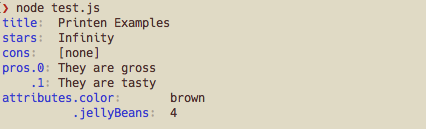

<h1><pre>
           .──────◯──────────────.
     _.─◯─'◦  ◯  ◦   ◯  ◦  ◯   ◯ ◡`─◌──.
  ,─___◡  __◌_  __◦ __ ◡  ___◦  __◦_  __'_.
 ╱ (  _ \(  _ \(  )(  ( \(_  _)(  __)(  ( \╲
(   ) __/ )   / )( /    /  )(   ) _) /    / )
▒`.(__)  (__\_)(__)\_)__) (__) (____)\_)__)'▒
 ▒▒'─. ◌  ◦   ◯ ◡   ◦ ◡  ◯ ◌   ◯     ◌ ,─'▒▒
   ▒▒▒`────◯ ◡   ◯   ◌     ◡ ◦   _.◯──'▒▒▒
      ▒▒▒▒▒▒`─◦─────────◯──────◯'▒▒▒▒▒▒
            ▒▒▒▒▒▒▒▒▒▒▒▒▒▒▒▒▒▒▒▒▒
</pre></h1>

> These [printens][printens] look so tasty, and quite similar to a package called stringify-object, which I love.

## Why

* Printed JSON objects should be easy readable by humans
* Printed JSON objects should be easy readable by robots

## Install

    $ npm install printen

## Usage

Running

```javascript
const printen = require('printen')
const exampleData = {
	title: "Printen Examples",
	stars: Number.POSITIVE_INFINITY,
	cons: undefined,
	pros: [
		'They are gross',
		'They are tasty'
	],
	cons: [],
	attributes: {
		color: 'brown',
		jellyBeans: 4
	}
}

console.log(printen(exampleData)
```

prints



Unnecessary clutter is hidden from the output, as the prefixes for subsequent attributes. But since it is hidden you can still access it via grep:

```
$ node printen-example.js | grep pros                   
pros.0:	They are gross
pros.1:	They are tasty
```

The key-value separator is in fact a colon and a tab-character therefore you can use cut to access the value:

```
$ node test.js | grep dependencies | cut -f 2
They are gross
They are tasty
```


## API

## License

MIT © [Florian Breisch](https://github.com/florianb)

[printens]: http://www.diaryofamadhausfrau.com/2010/12/aachener-printen-christmas-market.html "A printen recipe"
